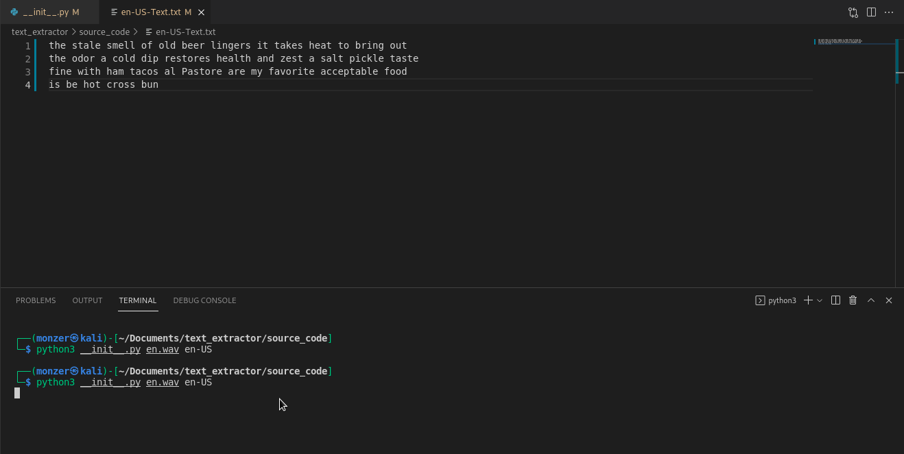

# Text Extractor
> extract the text from an audio file

I've created this tool to help me summarize my audio lectures. 





## Installation

This is a basic version downloading is NOT recommended.


## Usage example

from inside text_extractor/source_code directory run the following:

```sh
python3 __init__.py audio_file_url lang_code
```

for example:

```sh
python3 __init__.py en.wav en-US
```

# list of valid lang codes:
1. ar
2. en


## Development setup

install speech_recognition :

```sh
pip install SpeechRecognition
```

install bidi.algorithm :

```sh
pip install python-bidi
```

NOTE: you might need to use (pip or pip3) depending on the version you have. however,
use either one if didn't work use the other


## Release History

* 0.2.1
    * BUILD: Basic version of the tool


## Meta

Monzer Salah 
    – twitter: [@monzer404](https://www.twitter.com/monzer404) 
    – linkedin: [Monzer Salah](https://www.linkedin.com/in/monzer-salah-b83475201/)

Distributed under the XYZ license. See ``LICENSE`` for more information.

[https://github.com/yourname/github-link](https://github.com/dbader/)


## Contributing

1. Fork it (<https://github.com/monzer10/text_extractor/fork>)
2. add new features
3. pull request me


## What can you add to this project?

1. make the tool supports a new language
2. make it more user friendly
3. fix (see fixme.txt)